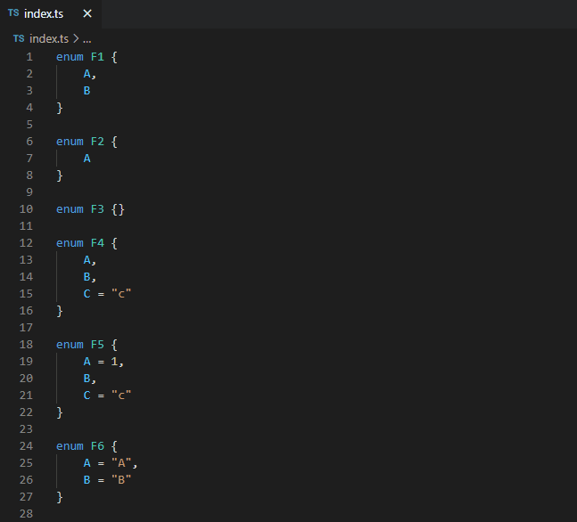

# ts-string-literal-enum-plugin

A tool that converts enums to string literal enum with only one click. Build with ❤️.

## Usages




## Install

### As VSCode extension

You can see [ts-string-literal-enum-plugin](https://marketplace.visualstudio.com/items?itemName=kingwl.ts-string-literal-enum-plugin).

### As typescript plugin

1. Install package

`yarn add ts-string-literal-enum-plugin`

or

`npm i ts-string-literal-enum-plugin`

2. Update tsconfig

```json

{
    "compilerOptions": {
        "plugins": [{
            "name": "ts-string-literal-enum-plugin",
        }]
    }
}

```

3. Use TypeScript from `node_modules`


Note: you can learn more at [here](https://code.visualstudio.com/docs/typescript/typescript-compiling#_using-newer-typescript-versions)

4. Enjoy :XD
